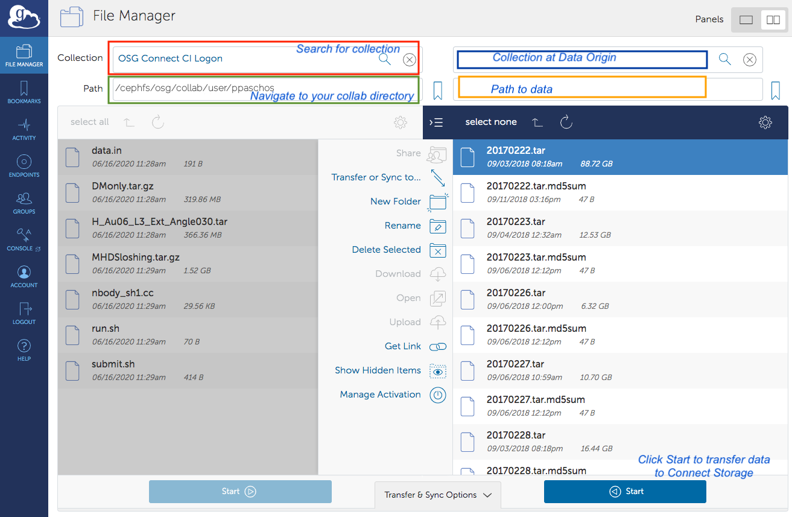

# Data Management

This section provides important information on how you can manage their data on the Snowmass21 connect node.

## Storage locations on Connect node

This section describes the storage locations available to the users on the Snowmass21 connect node.

1. **Home** directory. Your home directory, `/home/<user_id>`, has 50GB of storage available. It is recommended to use it for storing scripts, 
submission files and small size data. Large input files for jobs on the grid should not be stored here.
2. **Local storage** in`/project/users/<user_id>`. This is a 200TB local disk where you can store data and build your own software stack. It should be used as your private work area for local analysis or processing jobs on the node. 
3. **Stash storage** is accebible from the login node at `/collab`. Each user receives a 1TB quota for their personal user space. There is also a shared 50TB allocation for the project. This location is primarily intented for staging data that need to be accessible by the OSG compute sites running your job. There two subdirectories in `/collab`:  
    * For private user data: `/collab/user/<user_id>`  
    * For shared data among the members of the Snowmass21 project:`/collab/project/snowmass21/data`

## Transferring data 
You can transfer data from external institutions to the Snowmass21 Connect using any of the three following methods:

1. **scp**. For example: `scp -r <file_or_directory> <user_id>@login.snowmass21.io:/project/users/<user_id>/.` will copy a file or a directory
from your local machine to your user directory on stash storage. The ssh-keys used for your profile on the Snowmass Connect portal
must stored on the local machine.

2. **rsync**. For example: `rsync -avz -e "ssh -o StrictHostKeyChecking=no -o UserKnownHostsFile=/dev/null" --progress test.transfer <user_id>@login.snowmass21.io:dump/` will copy the `test.transfer` file in the `/home/<user_id>/dump/` directory. If the directory
does not exist, it will be created. As in `scp` the ssh-keys used for your profile on the Snowmass Connect portal
must stored on the source machine.

3. **Globus Connect** can be used to transfer files to stash storage only. Instructions on how to set up Globus Connect Personal can be found 
[here](https://www.globus.org/globus-connect-personal). Access to the stash storage endpoint is enabled by authenticating 
against the Globus collection "OSG Connect CI Logon" using the GLobus Connect client. 
You can search for the collection by name in the search bar of the File Manager.

In order to access the stash storage on the Connect node via Globus online, you must have an institutional 
based grid certificate issued by CILogon. To obtain one follow the steps below:

* Logon with your institutional credentials at [http://cilogon.org](http://cilogon.org)
* Select "Create a Password Protected Certificate". Enter a password and download your encrypted certificate, named usercred.p12. The certificate can be obtained by using the openssl pcks12 command as: `openssl pkcs12 -in [your-cert-file] -clcerts -nokeys -out usercert.pem`
* Email [paschos@uchicago.edu](paschos@uchicago.edu) the output of the following command which will print out your DN (Distinguish Name): `openssl x509 -in usercert.pem -noout -subject`

Once your DN has been entered in the user access list you will be able to access the OSG Connect CI Logon collection with the Globus Connect client by 
validating with your institution credentials. Navigate to the OSG Snowmass21 Collaborations Connect storage by typing in the Path box `/cephfs/osg/collab`. You can then navigate to your user directory as shown in the example below:

Shown in the image above are two possible destinations for the data.

* Navigate to `/cephfs/osg/collab/project/snowmass21` if data are to be shared by multiple users.
* Navigate to `/cephfs/osg/user/<user_id>` if data are for the exclusive use of a single user.
In both cases, users can create subdirectories and organize content by either using the Globus client interface or from the login.snowmass21.io node.

On the right panel of the Globus Connect client tool you can search and connect to another collection. 
The latter can be your own laptop/server or a collaboration end point that has provided a Globus Connect door for the researchers to use. To transfer files you can select the list files from your local computer and then select Start. To transfer files out simply reverse the direction of the process.

 **Important**: You can not access your home directories on the snowmass21 login node over the Globus door. However, you have access to the /stash/collab directory when they login to login.snowmass21.io. Files can then be moved or copied over to your home directory. 

## Data for grid jobs

There are four methods for the user to make data available to remote sites running their jobs.

1. HTCondor File Transfer. This method is recommended for the majority of computational workflows running on the OSG. Users can employ this method if the total size of the input data per job does not exceed 1 GB. In addition, OSG recommends that the output data per job that need to be transfered back does not exceed 1 GB as well. To enable HTCondor File transfers for your input and output data insert the following parameters anywhere in your HTCondor submit file:

        transfer_input_files = <comma separated files or directories>
        transfer_output_files = <comma separated files or directories>

This method can leverage any storage location on the Snowmass21 Connect node. However it is recommended that you primarily use `/local-scratch` and avoid the `/home/<user_id>` directory.

2. OSG's StashCache. To use this service, data should be placed either in `/collab/user/<user_id>` or 
`/collab/project/snowmass21`. This method is recommended for input files larger than 1 GB each or 10 GB total from all input data. The recommended upper limit for the output files to be transfered back from the remote node is 10 GB per job. Users can use the stashcp tool to transfer data from their `/collab` space only to the remote host. You can insert the following command in your execution script to transfer data from `/collab/user/<user_id>` to the local
directory on the remote worker node where your job is running:

        module load stashcache
        stashcp /osgconnect/collab/user/<user_id>/<input_file> .
        
To transfer data back to your collab space from the remote node run the following command in your execution script:

        stashcp <output_file> stash:///osgconnect/collab/user/<user_id>/<output_file>

3. If the filesize of each input dataset exceeds 10 GB then an alternative method for transfers is the GridFTP protocol using the gfal-copy tool. Please reach out for a consultation to discuss if your workflow can benefit from access to a GridFTP door.

4. Transfers over HTTP. Files stored in the shared namespace, `/collab/project/snowmass21` are public and also accessible via HTTP. To access datta there you can use linux tools like wget as shown in the following example:

        wget http://stash.osgconnect.net/collab/project/snowmass21/<file_name>

You can insert such command in your execution script to download datasets on the remote worker node where your job is running. Alternatively, you can declare those files inside your HTCondor submission script as follows:

        transfer_input_files = http://stash.osgconnect.net/collab/project/snowmass21/<file_name>

HTTP based transfers are best for filesizes up to 1GB.

